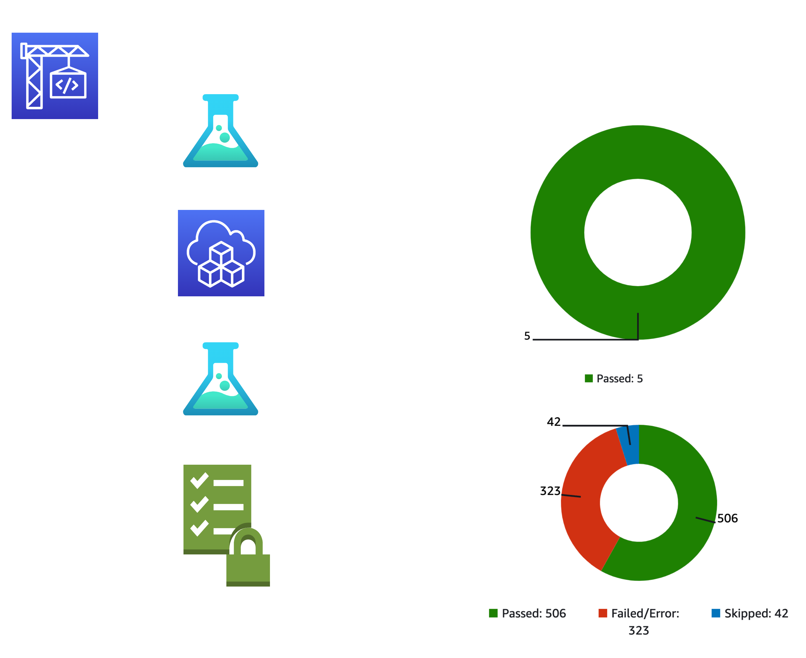

# DevSecOps

A standard serverless project with integration test for the application, the infrastructure and security scan according to AWS Foundational Security Best Practices controls.

Overview:



## The application and the infrastructure

The Lambda function writes the key of an incoming object from an S3 Bucket into a DynamoDB table.
 
See [Go on AWS Website](https://www.go-on-aws.com/architectures/serverless-dsl/) for a description of the architecture.

### Quick walkthrough:

1) Clone repository 
2) Create CodeCommit repository in your AWS account

    ```bash
    aws codecommit create-repository --repository-name devsecops
    ```

3) Add CodeCommit of your account as an origin to the repository cloned in step 1).

    If you have installed [git-remote-codecommit](https://github.com/aws/git-remote-codecommit) its easy.

    Replace `<region>` with the AWS region and `<profile>` with the AWS profile.

    ```bash
    git remote add aws codecommit::<region>://<profile>@devsecops
    ```

4) Push to AWS CodeCommit

    ```bash
    git push aws main
    ```

5) Create CICD

    CDK V2 has to be installed.

    ```bash
    cd cicd
    cdk deploy
    ```

6) Start the build project

    The build takes 5..6 minutes to complete.

    - Goto CodeBuild in the AWS console
    - Find and start build on project `devsecops`
    - Inspect logs while building

7) Show reports

    Examine the reports from the build project

    -  Unit Tests of application and infrastructure
    - Integration Tests of application and infrastructure
    - Security check


## See also

*  [AWS Foundational Security Best Practise controls](https://docs.aws.amazon.com/securityhub/latest/userguide/securityhub-standards-fsbp-controls.html)
* [AWS Compliance Mod](https://hub.steampipe.io/mods/turbot/aws_compliance)
* [steampipe](https://hub.steampipe.io/)

